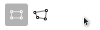

# Annotorious Toolbar

A simple toolbar to switch between drawing tools.



## Install

Include the plugin directly via the CDN:

```html
<html>
  <head>
    <!-- Annotorious -->
    <link rel="stylesheet" href="https://cdn.jsdelivr.net/npm/@recogito/annotorious@latest/dist/annotorious.min.css">
    <script src="https://cdn.jsdelivr.net/npm/@recogito/annotorious@latest/dist/annotorious.min.js"></script>

    <!-- Toolbar plugin -->
    <script src="https://cdn.jsdelivr.net/npm/@recogito/annotorious-toolbar@latest/dist/annotorious-toolbar.min.js"></script>
  </head>

  <body>
    <!-- The toolbar mounts itself into a DIV on your page -->
    <div id="my-toolbar-container"></div>

    
  </body>
</html>
```

Or if you are using npm:

``` 
$ npm install @recogito/annotorious-toolbar
```

Instantiate Annotorious the normal way, and then register the plugin:

```js
var anno = Annotorious.init({
  image: 'my-image'
});

// Init the plugin
Annotorious.Toolbar(anno, document.getElementById('my-toolbar-container'));
```

## Optional Settings

All settings are added as a third element that are key, value pairs. 

```
Annotorious.Toolbar(anno, document.getElementById('my-toolbar-container'), {'key': 'value', 'key2': 'value2'});
```
1. `withMouse`: adds Mouse icon to the toolbar for dragging around the image. Also changes the toolbar settings so that an annotation creation with a shape is always enabled until switched to the mouse icon.

```
Annotorious.Toolbar(anno, document.getElementById('my-toolbar-container'), {'withMouse': true});
```

2. `drawingTools`: a list of tools you want in the toolbar. The options are: [ 'annotorious-tilted-box', 'rect', 'polygon', 'circle', 'ellipse', 'freehand', 'point', 'line']. This allows you to order your toolbar in the order/items you want to show up. You have to have the specific tool installed in order for it to show up in your toolbar.

```
Annotorious.Toolbar(anno, document.getElementById('my-toolbar-container'), {'drawingTools': ['polygon', 'rect', 'circle']});
```

3. `infoElement`: a HTML element where hints about the drawing tools show up. Currently the only hint is the hint on how to stop the polygon tool.

```
Annotorious.Toolbar(anno, document.getElementById('my-toolbar-container'), {'infoElement': document.getElementById('info-element')});
```

4. `withLabel`: A setting that enables a text label for the drawing tool to show up next to the shape. For example, when enabled, there will the text 'Rectangle' next to the 'Rectangle' icon.

```
Annotorious.Toolbar(anno, document.getElementById('my-toolbar-container'), {'withLabel': true});
```

Questions? Feedack? Feature requests? Join the [Annotorious chat on Gitter](https://gitter.im/recogito/annotorious).

[](https://gitter.im/recogito/annotorious?utm_source=badge&utm_medium=badge&utm_campaign=pr-badge&utm_content=badge)

## License

[BSD-3 Clause](https://github.com/recogito/recogito-client-plugins/blob/main/packages/annotorious-tilted-box/LICENSE) (= feel 
free to use this code in whatever way you wish. But keep the attribution/license file, 
and if this code breaks something, don't complain to us :-)
